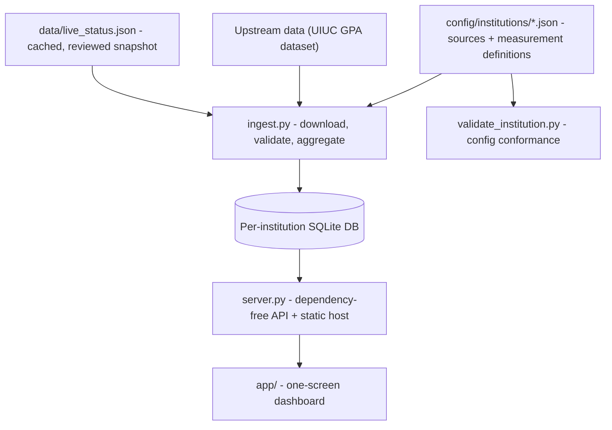

# Course Signal

An advisor-facing planning tool that reads a school's own course history and makes the next
scheduling conversation clearer. Institution-neutral by design: UIUC is the demo adapter,
not the product.

[](https://github.com/esaba12/course-signal/actions/workflows/checks.yml)


▶ [Watch with sound](https://ethansaba.com/videos/coursesignal.mp4): "Make the next planning conversation clearer."
· **[Live demo](https://course-signal-demo.vercel.app)**

## What it does

- **Reads historical enrollment** per course and term, and surfaces the trend an advisor
  would otherwise reconstruct by hand.
- **Works for any institution**: a school is a JSON config declaring its data sources and
  measurement definitions, not a code change.
- **Isolates institutions completely**: each one ingests into its own database, so a demo
  adapter can never bleed into another school's numbers.
- **Ships a one-screen dashboard** with no build step and no runtime dependencies.
- **States what it doesn't know**: see below.

## Important scope

This is an advisor-facing planning **signal**, not a capacity forecast, a waitlist
predictor, or an automated decision-maker. Historical headcount is the sum of students
receiving a final grade: it excludes withdrawals, and it does **not** equal initial
enrollment or seat capacity.

Live status snapshots are deliberately cached, timestamped, and reviewed before use. They
are never presented as continuously monitored data, because they aren't.

## Architecture

An adapter pattern: adding a school means adding a config file, never touching ingest.



## Run locally

```bash
python3 ingest.py --institution uiuc    # downloads + caches the dataset on first run
python3 server.py                       # http://localhost:8000
```

Pass `--refresh` to re-download rather than use the cached CSV.

To verify the portable reference deployment, the proof that nothing is UIUC-specific:

```bash
python3 validate_institution.py --institution riverview-demo
python3 ingest.py --institution riverview-demo
COURSE_SIGNAL_INSTITUTION=riverview-demo python3 server.py
```

## Notable decisions

**A school is a config file, not a fork.** `config/institutions/*.json` declares sources and
measurement definitions; `ingest.py` is adapter-driven and reads them. `riverview-demo` is a
synthetic institution that exists purely to prove UIUC assumptions haven't leaked into the
engine, and CI builds it on every push.

**Cached beats live when live would be a lie.** Course Explorer status is fetched into a
reviewed, timestamped snapshot rather than polled. A dashboard that implies real-time data
it doesn't have is worse than one that shows a date.

**The measurement definition ships with the number.** Headcount is grade-receiving
students, which is not enrollment, so the data dictionary and model card are part of the
product, not appendices. An advisor acting on a misread number is the actual failure mode.

**No build step, no runtime dependencies.** `server.py` is a plain Python API and static
host, so the demo runs anywhere Python does and can't break on a stale lockfile.

## Tests

CI compiles every script, builds the neutral fixture database from scratch, runs the
`unittest` suite, and drives the dashboard through Playwright in Chromium.

```bash
python -m unittest discover -s tests -v
python3 audit_data.py          # run before presenting
```

## Documentation

| Doc | What it covers |
|---|---|
| [Product pitch](docs/PRODUCT-PITCH.md) | Product story, and why UIUC appears in the demo |
| [Model card](docs/MODEL-CARD.md) | Measurement guardrails and stated limitations |
| [Data dictionary](docs/DATA-DICTIONARY.md) | Field-by-field definitions |
| [UIUC demo adapter](docs/UIUC-DEMO.md) | What the demo adapter does and doesn't assume |
| [Demo checklist](docs/DEMO-CHECKLIST.md) | Run before presenting |
| [Deployment](docs/DEPLOYMENT.md) · [Vercel](docs/VERCEL.md) | Local-first demo and serverless hosting |
| [Playwright](docs/PLAYWRIGHT.md) | Browser QA setup |

## Data credits

- Historical data: [wadefagen/datasets](https://github.com/wadefagen/datasets), UIUC GPA dataset.
- Planned live-status source: UIUC Course Explorer.

## Origin

Built for OpenAI Build Week, Education track, then generalized past the hackathon into an
institution-neutral tool. [Submission checklist](docs/DEVPOST-SUBMISSION.md).
